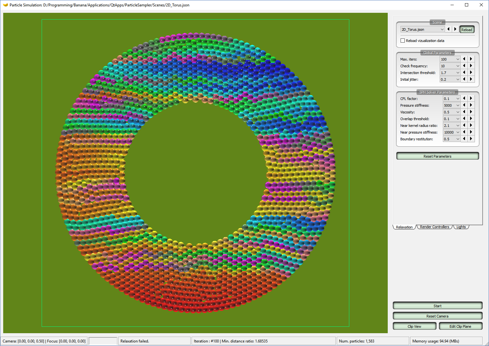

<p align="center">
<table style="border-collapse: collapse; border: none; width: 80%; margin-left:10%; margin-right:10%">
<tr>
<td></td>
<td></td>
<td></td>
</tr>
<tr>
<td></td>
<td></td>
<td></td>
</tr>
<tr>
<td></td>
<td></td>
<td></td>
</tr>
</table>
<br/>
<table style="border-collapse: collapse; border: none; width: 80%; margin-left:10%; margin-right:10%">
<tr>
<td></td>
<td></td>
<td></td>
</tr>
<tr>
<td></td>
<td></td>
<td></td>
</tr>
<tr>
<td></td>
<td></td>
<td></td>
</tr>
<tr>
<td></td>
<td></td>
<td></td>
</tr>
<tr>
<td></td>
<td></td>
<td></td>
</tr>
</table>
<br/>
<table style="border-collapse: collapse; border: none; width: 80%; margin-left:10%; margin-right:10%">
<tr>
<td></td>
<td></td>
</tr>
<tr>
<td></td>
<td></td>
</tr>
</table>
</p>


This is a tool for sampling particles within a given *signed distance field* object, and supports both 2D and 3D coordinates. The objects are constructed procedurally and their signed distance values are computed on-the-fly, except for the mesh objects. For mesh objects, a regular grid is allocated in memory then SDF values are propagated using the [SDFGen code](https://github.com/christopherbatty/SDFGen) provided by Chris. Batty. Initially, the particles are sampled in a regular sampling pattern. In order to obtain a better particle distribution, [SPH-based blue noise relaxation](https://dl.acm.org/citation.cfm?id=2818102) is executed over the generated particles. The generated particles can be written into disk for using in any other computation pipeline (see section `Output Data` below).

This program depends heavily on many external libraries, especially [Banana](https://github.com/ttnghia/Banana). Users should not expect to compile it by themselves but instead please download and run the provided binary (Windows x64) over the provided scene data.


### Download

* Windows binary and scene files: https://github.com/ttnghia/ParticleSampler/releases


### Brief Usage

Upon start up, a list of scene files stored in folder `Scenes` is loaded into the combobox `Scene` at top-right corner. Navigate through them, a scene is loaded and paticles are generate.

**Keyboard shortcuts**:
* `PageDown/PageUp`: change to next/previous scene.
* `F5`: reload scene.
* `Spacing`: start/stop relaxation.
* `C`: reset camera.
* `X`: clip view.
* `Left/Right/Up/Down arrow keys`: move object by the corresponding directions.


The scene description (including object type, transformation, particle sampling parameters etc.) is specified in a json file, which need to be put in the `Scene` folder. The scene syntax is very easy to infer from the provided examples.

As particle relaxation is very similar to a regular SPH-based fluid simulation, parameters need to be cranked up. A good practice is to run relaxation with default parameters (CFL factor `0.1` and max `100` iterations) firstly, then reduce the CFL factor to `0.01` and run for another `100` iterations, or until converged. SPH parameters are rarely needed to be turned.

**Relaxation parameters**:
* `Max. iters`: number of relaxation iterations.
* `Check frequency`: only check for distance between particles after a given number of iteration (frequency).
* `Intersection threshold`: the relaxation is considered as converged (and will be stopped) when the minimum distance between particles over particles radius is larger than this threshold.
* `Initial jitter`: before running relaxation, disturb the particles by a random distance sampled from [0, initial_jitter] multiplying with particle radius.

**SPH parameters**:
* `CFL factor`: control the moving speed of particles each time step (CFL factor `1.0` means allowing the particles to move at max by one particle radius each time step).
* `Pressure stiffness`: the stiffness of SPH pressure force.
* `Viscosity`: viscosity coefficient from the the viscosity formular using in the paper [Ghost SPH for Animating Water](https://dl.acm.org/citation.cfm?id=2185557).
* `Overlap threshold`: when the distance between two particles is smaller than `overlap_theshold*particle_radius`, the relative orientation between them is not taken into account during computation. Instead, a random direction is choosen.
* `Near kernel radius ratio`: in addition to the regular SPH model, I implement a short range penalty force model for better resolving particle overlapping. Its kernel radius is given by `near_kernel_radius_ratio*particle_radius`.
* `Near pressure stiffness`: the magnitude of short range penalty forces.
* `Boundary restitution`: when a particle hits the boundary, its velocity will be reflected off the boundary, then multiplied with this coefficient.

**Other parameters**:
* Specialized object parameters are demonstrated in the example scene files.
* The scene file can also contain information about camera and (point) light used for visualizing the particles.
* Some other global parameters such as main window size, default scene ID and number of working threads can be specified in the `config.ini` file at root folder.


### Output Data

The generated particles can be written into disk in one of 3 formats: OBJ, BGEO, and binary. The binary format has the following layout:
```
Bytes 0-3(unsigned int): number of particles
Bytes 4-7(float): particle radius
Next (4 x 3 x numParticles) bytes: array of particle positions
```

Specifying output file need to follow the syntax as in this example:
```
"UseFileCache" : true,
"ParticleFileType" : "bgeo",
"ParticleOutputFile" : "Data/3D_mesh_lion.bgeo"
```

If `UseFileCache` is `false`, no file is written. `ParticleFileType` need to be either `obj`, `bgeo`, or `binary`. `ParticleOutputFile` need to be a file in an existing folder. If the intermediate folder(s) leading to this file does not exist, file writing will fail.

When a scene is loaded, particles are sampled in regular sampling pattern (maybe with some amount of jittering), and the output file is written immediately. After each time of running relaxation (either failed after reaching max_iters, or converged), the output file is written again (overwritten).


### Other Features

By default, particles are color coded by the order they are generated (from red to blue). Other particle color modes and other render parameters can be selected in the tab *Render Controllers*. 

**Textures:** Skybox textures and floor textures are loaded from disk at start up time. Users can modify textures to their own in the `Textures` folder. Note that each skybox texture needs to be put in a separate subfolder while all floor textures are put in the same folder.


### References

* http://iquilezles.org/www/articles/distfunctions/distfunctions.htm
* https://github.com/christopherbatty/SDFGen
* https://dl.acm.org/citation.cfm?id=2818102
* https://dl.acm.org/citation.cfm?id=2185557


---
Happy coding!